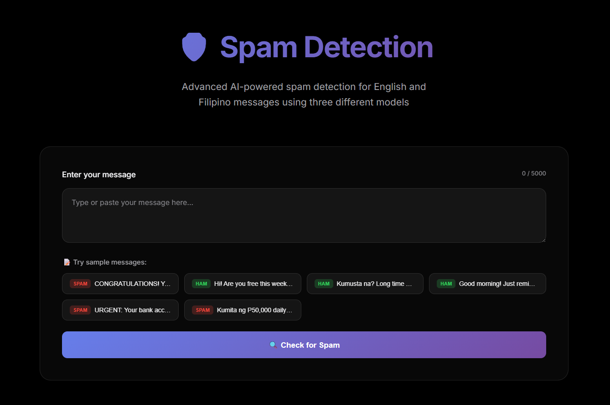
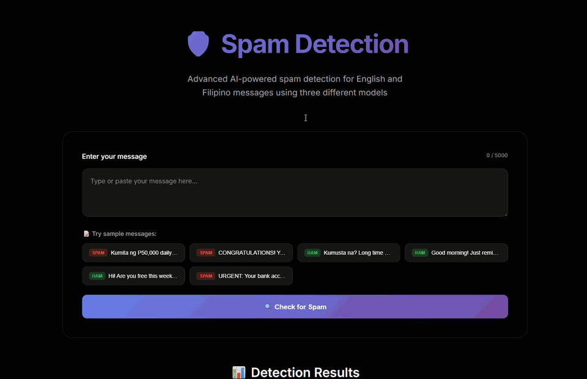
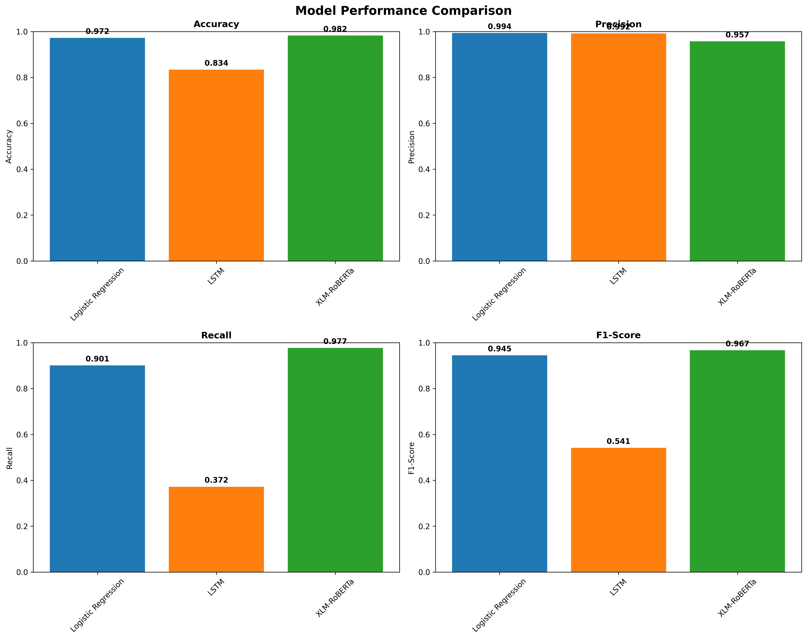

# Taglish & English SMS Spam Detection System

An AI-powered spam detection system specifically trained and evaluated on Taglish (Tagalog-English code-switched) and English SMS messages (7,507 total records). The project evaluates and compares three distinct machine learning paradigms—Traditional ML (TF-IDF + Logistic Regression), Deep Learning (LSTM), and Modern Multilingual Transformers (XLM-RoBERTa)—serving them via a unified Flask web interface and API.



---

## 🎥 Live Interactive Demo



---

## 📊 Model Performance Comparison

All models were evaluated on the same independently held-out test set (20% split, 1,309 samples).

| Model | Architecture / Approach | Accuracy | Precision | Recall | F1-Score |
| :--- | :--- | :---: | :---: | :---: | :---: |
| **XLM-RoBERTa Base** | Multilingual Transformer | **98.24%** | 95.73% | **97.67%** | **96.69%** |
| **Logistic Regression** | TF-IDF (1-2 n-grams) | 97.25% | **99.36%** | 90.12% | 94.51% |
| **LSTM (RNN)** | Standalone Keras/NumPy | 83.42% | 99.22% | 37.21% | 54.12% |



> [!NOTE]
> **Key Finding — Debugging the LSTM's Low Recall**:
> During independent post-training evaluation, I discovered that the LSTM's recall dropped from 94.48% during validation to 37.21% on raw test inputs. Investigation revealed a **train/inference preprocessing mismatch**: the original training script (`models/lstm/train_model.py`) stripped NLTK stopwords and punctuation from inputs before sequence vectorization, whereas the serving inference code (`web_ui/app.py`) processed raw text without NLTK stopword stripping. When uncleaned tokens enter the fixed vocabulary, word alignments shift and cause missed spam detections. Sourcing metrics from `metrics.json` ensures full transparency regarding this engineering finding.

---

## 📁 Repository Structure

```text
taglish-spam-detection/
├── Dockerfile                      # Production Docker container (python:3.11-slim, CPU PyTorch)
├── .dockerignore                   # Build exclusion rules
├── requirements.txt                # Lightweight runtime inference dependencies
├── requirements-training.txt       # Full training and development dependencies
├── evaluate_models.py              # Independent test-set evaluation script
├── metrics.json                    # Sourced benchmark metrics across all models
├── thresholds.json                 # Tuned F1-optimal decision thresholds
├── assets/
│   ├── model_comparison.png        # Benchmark evaluation chart
│   └── screenshots/                # Application UI screenshots & demo GIFs
│       ├── landing_page.png
│       └── spam_detect_all_demo.gif
├── dataset/
│   ├── final_spam_ham_dataset.csv  # 7,507 labeled Taglish/English SMS dataset
│   └── build_final_dataset.py      # Dataset preparation script
├── docs/
│   └── academic/                   # Thesis artifacts & research notes
│       ├── chapter4_results.txt
│       ├── presentation_slides.md
│       ├── confusion_matrices_comparison.png
│       ├── metrics_summary.csv
│       └── presentation_viz/
├── models/
│   ├── logistic_regression/        # TF-IDF vectorizer & Logistic Regression artifacts
│   ├── lstm/                       # Keras H5 weights & tokenizer mapping
│   └── xlm-roberta/                # Fine-tuned XLM-RoBERTa Transformer safetensors
└── web_ui/                         # Serving application
    ├── app.py                      # Flask web application & standalone inference engines
    ├── templates/
    │   └── index.html              # HTML interface structure
    └── static/
        ├── css/
        │   └── style.css           # UI styling and dark theme
        └── js/
            └── main.js             # Client-side form handling & dynamic rendering
```

---

## 🐳 Run Locally with Docker

The application is containerized using `python:3.11-slim` with PyTorch CPU wheels for lightweight, reproducible execution without external GPUs.

```bash
# 1. Build the Docker image
docker build -t taglish-spam-detection .

# 2. Run the container on port 7860
docker run -p 7860:7860 taglish-spam-detection
```

Once running, access the web interface at **`http://localhost:7860`**.

### API Endpoints

* **`POST /predict`**: Accepts `{"message": "Text to analyze"}` and returns probability scores, decision thresholds, and ensemble verdict across all three models.
* **`GET /health`**: Returns system health, loaded model flags, and benchmark metadata.
* **`GET /samples`**: Returns preset Taglish spam and ham test messages.

---

## 🏋️ Train and Evaluate Models

To retrain or re-evaluate models from scratch:

```bash
# Install full training dependencies
pip install -r requirements-training.txt

# Run independent evaluation across all models
python evaluate_models.py
```

---

## 🚀 Future Work

- [ ] **Real-time SMS Gateway Integration**: Connect with Twilio or local cellular gateways for live message filtering.
- [ ] **Mobile App Interface**: Build a Flutter / Android client for on-device spam classification.
- [ ] **Data Pipeline Expansion**: Expand Taglish spam dataset to cover emerging phishing / scam message patterns.

---

## 👥 Contributors

- **Marcus Oliver** — Logistic Regression
- **Dominic Vilog** — LSTM
- **Ian Placencia** — XLM-RoBERTa
- **Professor**: Dr. Gerard Francesco Apolinario

---

## 📄 License

Distributed under the MIT License.
